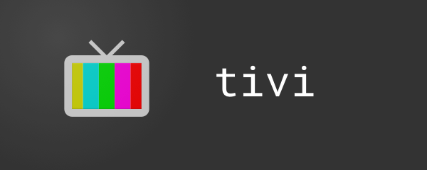

# Tivi has now deprecated

After roughly 9 years of development, I've decided that now (12th November 2024) is the time for Tivi to be 'complete'. After releasing 1.0.0 recently, I unfortunately just don't have the time or inclination to keep developing the app.

Another reason which has prompted this change is that I have no intention of allowing Google Play to publish my home address (through it's '[verification](https://support.google.com/googleplay/android-developer/answer/14177239?hl=en)' process), therefore my developer account has been restricted and locked. C'est la vie. 

I've also delisted the app on the iOS App Store.

Thanks to everyone who has used and tested the app. I hope that it's been useful to learn from.

🫡

---




Tivi is a TV show tracking application which connects to [Trakt.tv](https://www.trakt.tv). It has been updated over the years to target a number of platforms, built upon Kotlin Multiplatform and Compose Multiplatform.

## Download

<a href="https://play.google.com/store/apps/details?id=app.tivi" target="_blank">

</a>

## Platforms

### Android

Tivi started out as an open source Android app, showcasing cutting technologies through its development. The codebase was transformed in late-2022 to be built upon [Kotlin Multiplatform](https://kotlinlang.org/docs/multiplatform.html), allowing us to re-use a large proportion of the code across different platforms.

### iOS

The iOS app is well maintained (the main developers uses it daily). To aid development time, most of the UIs are shared with the Android app, enabled through [Compose Multiplatform](https://www.jetbrains.com/lp/compose-multiplatform/).

### Desktop JVM

Tivi is built for Desktop running as a Java app. Unfortunately we don’t have feature parity on the desktop target due to either missing APIs, or lack of priority by the maintainer to implement them. However the basics of the app do work.

## Development Setup

### Android and Desktop

Tivi is a standard Gradle project which can be opened in recent versions of Android Studio or IntelliJ.

- The Android application module is located at [android-app/app/](android-app/app) (`:android-app:app`).
- The Desktop application module is located at [desktop-app/](desktop-app) (`:desktop-app`).

### iOS

The iOS project is setup as a typical Xcode project. It currently uses [CocoaPods](https://cocoapods.org/) to manage dependencies, and therefore you’ll need to install this before opening the Xcode project.

Let's step through it:

#### Setup Ruby

We need Ruby for various dependencies, therefore we need a Ruby environment. I recommend using [rbenv](https://github.com/rbenv/rbenv), but that's just a suggestion:

```shell
brew install rbenv

rbenv init

# Download Ruby 3.3.4 and set it as the global version
rbenv install 3.3.4
rbenv global 3.3.4

# Install bundler
gem install bundler
```

#### Xcode

We use the latest version of Xcode supported by Kotlin Multiplatform, which is defined in the [.xcode-version](.xcode-version) file.

We enforce the Xcode version on CI, but locally you can use whatever version you want. The [Xcodes.app](https://www.xcodes.app/) application is a great way to install different versions.

#### Nearly there

After you have installed the dependencies, you can now pull down the dependencies:

``` shell
cd /path/to/tivi/checkout

# Install all of the Ruby dependencies
bundle install

# Install pods
pod install --project-directory=ios-app/Tivi
```

#### Open the project in Xcode

Finally, we can open the project in Xcode. Open Xcode and then point it to the workspace file at: [`ios-app/Tivi/Tivi.xcworkspace`](ios-app/Tivi/Tivi.xcworkspace).

Press Run and it should build!

### Code style

This project uses [ktlint](https://github.com/pinterest/ktlint), provided via
the [spotless](https://github.com/diffplug/spotless) gradle plugin, and the bundled project IntelliJ codestyle.

If you find that one of your pull reviews does not pass the CI server check due to a code style conflict, you can fix it by running: `./gradlew spotlessApply`.

### API keys

You need to supply API / client keys for the various services the
app uses:

- [Trakt.tv](https://trakt.docs.apiary.io)
- [TMDb](https://developers.themoviedb.org)

You can find information about how to gain access via the relevant links.

When creating a Trakt API project, you need to set the OAuth redirect uri to `app.tivi.debug://auth/oauth2callback` for debug build types, or `app.tivi://auth/oauth2callback` for release build types.

Once you obtain the keys, you can set them in your `~/.gradle/gradle.properties`:

```
# Get these from Trakt.tv
TIVI_TRAKT_CLIENT_ID=<insert>
TIVI_TRAKT_CLIENT_SECRET=<insert>

# Get this from TMDb
TIVI_TMDB_API_KEY=<insert>
```

## Contributions

If you've found an error in this sample, please file an issue.

Patches are encouraged and may be submitted by forking this project and
submitting a pull request. Since this project is still in its very early stages,
if your change is substantial, please raise an issue first to discuss it.

## License

```
Copyright 2016-2021 Google LLC
Copyright 2023 Christopher Banes

Licensed under the Apache License, Version 2.0 (the "License");
you may not use this file except in compliance with the License.
You may obtain a copy of the License at

    https://www.apache.org/licenses/LICENSE-2.0

Unless required by applicable law or agreed to in writing, software
distributed under the License is distributed on an "AS IS" BASIS,
WITHOUT WARRANTIES OR CONDITIONS OF ANY KIND, either express or implied.
See the License for the specific language governing permissions and
limitations under the License.
```
